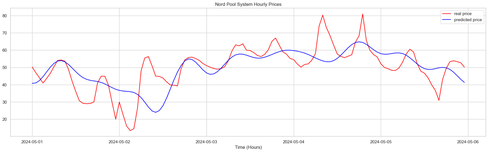
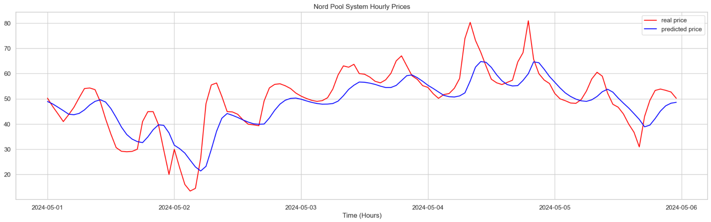
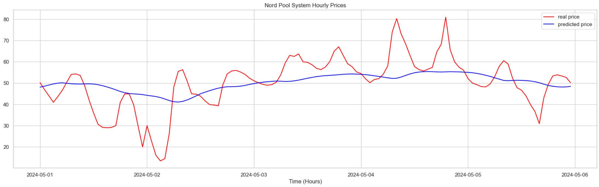
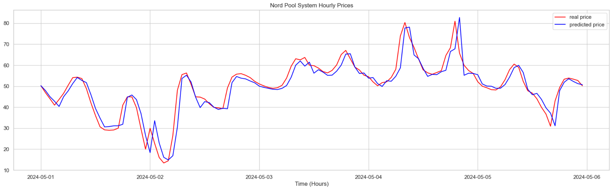
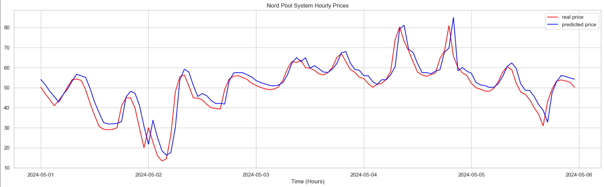

# NORD POOL Electricity Price Prediction (PP9)

## Project Overview
This project aims to predict hourly electricity prices for May 2024 using LSTM and GRU networks. Initial data was
manually collected from the Nord Pool Group's website and included in an Excel file prepared via a Python script.

### Data Source
Data was gathered from Nord Pool for March and April 2024, focusing on hourly electricity prices. The data is
preprocessed to avoid NaNs and is compatible with direct import into a pandas DataFrame.

### Project Files
- `nordpool_predictions_electricity-1hour.ipynb`: Main Jupyter Lab notebook containing the models.
- `excel_generator.py`: Python script for generating Excel file with preprocessed timestamps for data collection.
- `market_data.xlsx`: Contains the actual market data of prices and turnovers.

## Approach
The project utilizes Long Short-Term Memory (LSTM) and Gated Recurrent Unit (GRU) networks to forecast
electricity prices. These networks are well-suited for time-series prediction due to their ability to capture temporal
dynamics.

## Experiences, Challenges, and Model Comparisons

### Managing Data Complexity
One of the most significant challenges encountered was managing and navigating through various data types and
structures (shapes). These were essential for different stages of the modeling process, including feeding data into
the models, creating sequences, scaling, and visualization. The complexity of switching between these different forms
often made it easy to lose track of the overall workflow.

### Sequence length
For such a small dataset and minimal prediction length (1 hour), any sequence length larger than 3 worked well, but
the most accurate results were achieved with sequence lengths ranging from 12 for LSTM to 48 for GRU.

### Model Performance and Optimizations
Initially, both LSTM and GRU models, applied to a relatively simple dataset with a very short prediction horizon
(1 hour), showed good accuracy. However, attempts to increase the model complexity by adding more layers or units
resulted in diminished learning capabilities of LSTM, but GRU model kept is accuracy. This was illustrated through
comparative visualizations:

- **Simple Model vs. Expanded Model**: The simple LSTM model maintained higher accuracy and learning efficiency.  
Simple LSTM Model Accuracy
 vs.   Expanded LSTM Model Performance 
- **Optimizer Efficiency**: The Adam optimizer consistently outperformed the RMSprop and SGD optimizerers on LSTM,
demonstrating better accuracy and faster convergence, but GRU kept showing comparable accurate results.  
RMSprop Optimizer Results on LSTM
 and   SGD Optimizer Results on LSTM 
- **Sequence Lenght**: Sequence length larger than 3 worked well, but the most accurate results were achieved with sequence
lengths ranging from 12 for LSTM to 48 for GRU.  
Sequence Length 48 on GRU
 vs   Sequence Length 3 on GRU 

### Learning Dynamics
With minimal data, the models learned quite rapidly. However, introducing additional regularizations, dropout layers
or decreasing the learning rate often led to underfitting. This underperformance highlights the delicate balance
required in tuning the model parameters for small datasets.

## Future Directions
- Explore multi-output predictions to enhance forecasting capabilities.
- Employ feature engineering to enrich the dataset and potentially improve model performance.
- Extend the forecasting window beyond the current one-hour limit.
- Allocate more time for project expansion and deeper analysis, overcoming the current time constraints faced due
to other commitments like the capstone project.

## Conclusion
The project demonstrated the effectiveness of LSTM and GRU models for short-term electricity price forecasting,
emphasizing the importance of model simplicity for learning from small datasets.
